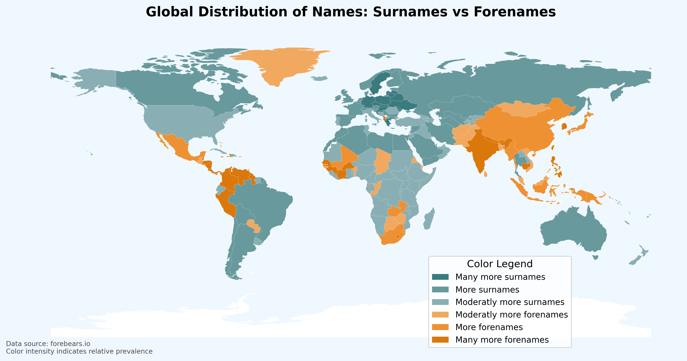

# Global Name Distribution Analysis

Visualizing the prevalence of surnames vs. forenames across countries using web scraping and geopandas mapping.



## Features
- Scrapes name statistics from [forebears.io](https://forebears.io)
- Compares surname/forename distribution by country
- Generates color-coded world map visualizations
- Automatic data caching (saves to `data.csv`)
- Handles 200+ countries with ISO Alpha-3 codes

## Requirements
```bash
pip install requests beautifulsoup4 pandas geopandas matplotlib pycountry
```

## Usage
```python
python alkab.py
```

## Data Sources
- Name data: [forebears.io](https://forebears.io)
- Country shapes: Natural Earth (110m admin 0 countries)

## Methodology
1. Scrapes country name pages for surname/forename counts
2. Calculates forename-to-surname ratio
3. Classifies countries into 6 color tiers
4. Merges with geographic data
5. Generates visualization

## Output
- World map (saved as `world_map.png`)
- CSV dataset (`data.csv`) with:
  - Country ISO codes
  - County name
  - Surname counts
  - Forename counts
